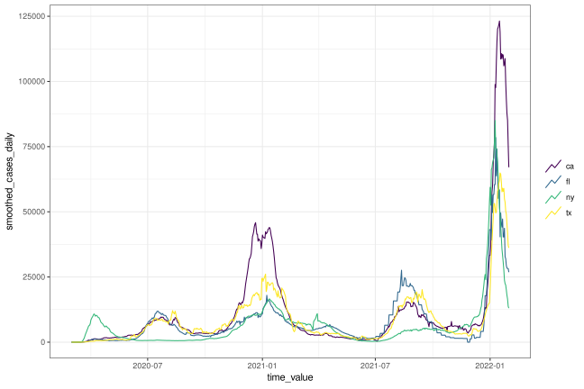

<!-- README.md is generated from README.Rmd. Please edit that file -->

# epiprocess

The `{epiprocess}` package works with epidemiological time series data
and provides tools to manage, analyze, and process the data in
preparation for modeling. It is designed to work in tandem with
`{epipredict}`, which provides pre-built epiforecasting models and as
well as tools to build custom models. Both packages are designed to
lower the barrier to entry and implementation cost for epidemiological
time series analysis and forecasting.

`{epiprocess}` contains:

  - `epi_df()` and `epi_archive()`, two data frame classes (that work
    like a `{tibble}` with `{dplyr}` verbs) for working with
    epidemiological time series data;
  - signal processing tools building on these data structures such as
      - `epi_slide()` for sliding window operations;
      - `epix_slide()` for sliding window operations on archives;
      - `growth_rate()` for computing growth rates;
      - `detect_outlr()` for outlier detection;
      - `epi_cor()` for computing correlations;

If you are new to this set of tools, you may be interested learning
through a book format: [Introduction to Epidemiological
Forecasting](https://cmu-delphi.github.io/delphi-tooling-book/).

You may also be interested in:

  - `{epidatr}`, for accessing wide range of epidemiological data sets,
    including COVID-19 data, flu data, and more.
  - `{rtestim}`, a package for estimating the time-varying reproduction
    number of an epidemic.

This package is provided by the [Delphi group](https://delphi.cmu.edu/)
at Carnegie Mellon University.

## Installation

To install:

``` r
# Stable version
pak::pkg_install("cmu-delphi/epiprocess@main")

# Dev version
pak::pkg_install("cmu-delphi/epiprocess@dev")
```

The package is not yet on CRAN.

## Usage

Once `epiprocess` and `epidatr` are installed, you can use the following
code to get started:

``` r
library(epiprocess)
library(epidatr)
library(dplyr)
library(magrittr)
```

Get COVID-19 confirmed cumulative case data from JHU CSSE for
California, Florida, New York, and Texas, from March 1, 2020 to January
31, 2022

``` r
df <- pub_covidcast(
  source = "jhu-csse",
  signals = "confirmed_cumulative_num",
  geo_type = "state",
  time_type = "day",
  geo_values = "ca,fl,ny,tx",
  time_values = epirange(20200301, 20220131),
  as_of = as.Date("2024-01-01")
) %>%
  select(geo_value, time_value, cases_cumulative = value)
df
#> # A tibble: 2,808 × 3
#>   geo_value time_value cases_cumulative
#>   <chr>     <date>                <dbl>
#> 1 ca        2020-03-01               19
#> 2 fl        2020-03-01                0
#> 3 ny        2020-03-01                0
#> 4 tx        2020-03-01                0
#> 5 ca        2020-03-02               23
#> 6 fl        2020-03-02                1
#> # ℹ 2,802 more rows
```

Convert the data to an epi\_df object and sort by geo\_value and
time\_value. You can work with an `epi_df` like you can with a
`{tibble}` by using `{dplyr}` verbs

``` r
edf <- df %>%
  as_epi_df(as_of = as.Date("2024-01-01")) %>%
  arrange_canonical() %>%
  group_by(geo_value) %>%
  mutate(cases_daily = cases_cumulative - lag(cases_cumulative, default = 0))
edf
#> An `epi_df` object, 2,808 x 4 with metadata:
#> * geo_type  = state
#> * time_type = day
#> * as_of     = 2024-01-01
#> 
#> # A tibble: 2,808 × 4
#> # Groups:   geo_value [4]
#>   geo_value time_value cases_cumulative cases_daily
#> * <chr>     <date>                <dbl>       <dbl>
#> 1 ca        2020-03-01               19          19
#> 2 ca        2020-03-02               23           4
#> 3 ca        2020-03-03               29           6
#> 4 ca        2020-03-04               40          11
#> 5 ca        2020-03-05               50          10
#> 6 ca        2020-03-06               68          18
#> # ℹ 2,802 more rows
```

Compute the 7 day moving average of the confirmed daily cases for each
geo\_value

``` r
edf <- edf %>%
  group_by(geo_value) %>%
  epi_slide_mean(cases_daily, .window_size = 7, na.rm = TRUE) %>%
  rename(smoothed_cases_daily = slide_value_cases_daily)
edf
#> An `epi_df` object, 2,808 x 5 with metadata:
#> * geo_type  = state
#> * time_type = day
#> * as_of     = 2024-01-01
#> 
#> # A tibble: 2,808 × 5
#> # Groups:   geo_value [4]
#>   geo_value time_value cases_cumulative cases_daily smoothed_cases_daily
#> * <chr>     <date>                <dbl>       <dbl>                <dbl>
#> 1 ca        2020-03-01               19          19                19   
#> 2 ca        2020-03-02               23           4                11.5 
#> 3 ca        2020-03-03               29           6                 9.67
#> 4 ca        2020-03-04               40          11                10   
#> 5 ca        2020-03-05               50          10                10   
#> 6 ca        2020-03-06               68          18                11.3 
#> # ℹ 2,802 more rows
```

Autoplot the confirmed daily cases for each geo\_value

``` r
edf %>%
  autoplot(smoothed_cases_daily)
```


