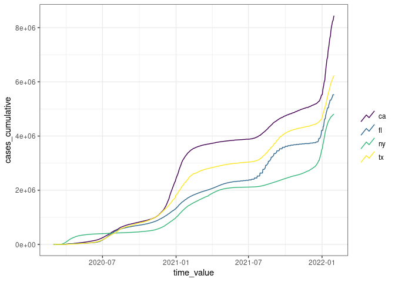

<!-- README.md is generated from README.Rmd. Please edit that file -->

# epiprocess

The [`{epiprocess}`](https://cmu-delphi.github.io/epiprocess/) package
works with epidemiological time series data to provide situational
awareness, processing, and transformations in preparation for modeling,
and version-faithful model backtesting. It contains:

- `epi_df`, a class for working with epidemiological time series data
  which behaves like a tibble (and can be manipulated with
  [`{dplyr}`](https://dplyr.tidyverse.org/)-esque “verbs”) but with
  some additional structure;
- `epi_archive`, a class for working with the version history of such
  time series data;
- sample epidemiological data in these formats;

This package is provided by the Delphi group at Carnegie Mellon
University. The Delphi group provides many tools also hosts the Delphi
Epidata API, which provides access to a wide range of epidemiological
data sets, including COVID-19 data, flu data, and more. This package is
designed to work seamlessly with the data in the Delphi Epidata API,
which can be accessed using the `epidatr` package.

It is part of a broader suite of packages that includes
[`{epipredict}`](https://cmu-delphi.github.io/epipredict/),
[`{epidatr}`](https://cmu-delphi.github.io/epidatr/),
[`{rtestim}`](https://dajmcdon.github.io/rtestim/), and
[`{epidatasets}`](https://cmu-delphi.github.io/epidatasets/), for
accessing, analyzing, and forecasting epidemiological time series data.
We have expanded documentation and demonstrations for some of these
packages available in an online “book” format
[here](https://cmu-delphi.github.io/delphi-tooling-book/).

## Motivation

[`{epiprocess}`](https://cmu-delphi.github.io/epiprocess/) and
[`{epipredict}`](https://cmu-delphi.github.io/epipredict/) are designed
to lower the barrier to entry and implementation cost for
epidemiological time series analysis and forecasting. Epidemiologists
and forecasting groups repeatedly and separately have had to rush to
implement this type of functionality in a much more ad hoc manner; we
are trying to save such effort in the future by providing
well-documented, tested, and general packages that can be called for
many common tasks instead.

## Installation

To install:

```r
# Stable version
pak::pkg_install("cmu-delphi/epiprocess@main")

# Dev version
pak::pkg_install("cmu-delphi/epiprocess@dev")
```

The package is not yet on CRAN.

## Usage

Once `epiprocess` and `epidatr` are installed, you can use the following
code to get started:

```r
library(epiprocess)
library(epidatr)
library(dplyr)
library(magrittr)
```

Get COVID-19 confirmed cumulative case data from JHU CSSE for
California, Florida, New York, and Texas, from March 1, 2020 to January
31, 2022

```r
df <- pub_covidcast(
  source = "jhu-csse",
  signals = "confirmed_cumulative_num",
  geo_type = "state",
  time_type = "day",
  geo_values = "ca,fl,ny,tx",
  time_values = epirange(20200301, 20220131),
) %>%
  select(geo_value, time_value, cases_cumulative = value)
df
#> # A tibble: 2,808 × 3
#>    geo_value time_value cases_cumulative
#>    <chr>     <date>                <dbl>
#>  1 ca        2020-03-01               19
#>  2 fl        2020-03-01                0
#>  3 ny        2020-03-01                0
#>  4 tx        2020-03-01                0
#>  5 ca        2020-03-02               23
#>  6 fl        2020-03-02                1
#>  7 ny        2020-03-02                0
#>  8 tx        2020-03-02                0
#>  9 ca        2020-03-03               29
#> 10 fl        2020-03-03                2
#> # ℹ 2,798 more rows
```

Convert the data to an epi_df object and sort by geo_value and
time_value. You can work with the epi_df object like a tibble using
dplyr

```r
edf <- df %>%
  as_epi_df() %>%
  arrange_canonical() %>%
  group_by(geo_value) %>%
  mutate(cases_daily = cases_cumulative - lag(cases_cumulative, default = 0))
edf
#> An `epi_df` object, 2,808 x 4 with metadata:
#> * geo_type  = state
#> * time_type = day
#> * as_of     = 2024-10-04 13:32:23.730165
#>
#> # A tibble: 2,808 × 4
#> # Groups:   geo_value [4]
#>    geo_value time_value cases_cumulative cases_daily
#>  * <chr>     <date>                <dbl>       <dbl>
#>  1 ca        2020-03-01               19          19
#>  2 ca        2020-03-02               23           4
#>  3 ca        2020-03-03               29           6
#>  4 ca        2020-03-04               40          11
#>  5 ca        2020-03-05               50          10
#>  6 ca        2020-03-06               68          18
#>  7 ca        2020-03-07               94          26
#>  8 ca        2020-03-08              113          19
#>  9 ca        2020-03-09              136          23
#> 10 ca        2020-03-10              158          22
#> # ℹ 2,798 more rows
```

Autoplot the confirmed daily cases for each geo_value

```r
edf %>%
  autoplot(cases_cumulative)
```



Compute the 7 day moving average of the confirmed daily cases for each
geo_value

```r
edf %>%
  group_by(geo_value) %>%
  epi_slide_mean(cases_daily, .window_size = 7, na.rm = TRUE)
#> An `epi_df` object, 2,808 x 5 with metadata:
#> * geo_type  = state
#> * time_type = day
#> * as_of     = 2024-10-04 13:32:23.730165
#>
#> # A tibble: 2,808 × 5
#> # Groups:   geo_value [4]
#>    geo_value time_value cases_cumulative cases_daily slide_value_cases_daily
#>  * <chr>     <date>                <dbl>       <dbl>                   <dbl>
#>  1 ca        2020-03-01               19          19                   19
#>  2 ca        2020-03-02               23           4                   11.5
#>  3 ca        2020-03-03               29           6                    9.67
#>  4 ca        2020-03-04               40          11                   10
#>  5 ca        2020-03-05               50          10                   10
#>  6 ca        2020-03-06               68          18                   11.3
#>  7 ca        2020-03-07               94          26                   13.4
#>  8 ca        2020-03-08              113          19                   13.4
#>  9 ca        2020-03-09              136          23                   16.1
#> 10 ca        2020-03-10              158          22                   18.4
#> # ℹ 2,798 more rows
```

Compute the growth rate of the confirmed cumulative cases for each
geo_value

```r
edf %>%
  group_by(geo_value) %>%
  mutate(cases_growth = growth_rate(x = time_value, y = cases_cumulative, method = "rel_change", h = 7))
#> An `epi_df` object, 2,808 x 5 with metadata:
#> * geo_type  = state
#> * time_type = day
#> * as_of     = 2024-10-04 13:32:23.730165
#>
#> # A tibble: 2,808 × 5
#> # Groups:   geo_value [4]
#>    geo_value time_value cases_cumulative cases_daily cases_growth
#>  * <chr>     <date>                <dbl>       <dbl>        <dbl>
#>  1 ca        2020-03-01               19          19        0.534
#>  2 ca        2020-03-02               23           4        0.579
#>  3 ca        2020-03-03               29           6        0.596
#>  4 ca        2020-03-04               40          11        0.569
#>  5 ca        2020-03-05               50          10        0.556
#>  6 ca        2020-03-06               68          18        0.531
#>  7 ca        2020-03-07               94          26        0.490
#>  8 ca        2020-03-08              113          19        0.436
#>  9 ca        2020-03-09              136          23        0.420
#> 10 ca        2020-03-10              158          22        0.409
#> # ℹ 2,798 more rows
```

Detect outliers in the growth rate of the confirmed cumulative cases for
each

```r
edf %>%
  group_by(geo_value) %>%
  mutate(outlier_info = detect_outlr(x = time_value, y = cases_daily)) %>%
  ungroup()
#> Adding missing grouping variables: `geo_value`
#> Adding missing grouping variables: `rm_geo_value`
#> Adding missing grouping variables: `rm_geo_value`
#> Adding missing grouping variables: `rm_geo_value`
#> Adding missing grouping variables: `geo_value`
#> Adding missing grouping variables: `rm_geo_value`
#> Adding missing grouping variables: `rm_geo_value`
#> Adding missing grouping variables: `rm_geo_value`
#> Adding missing grouping variables: `geo_value`
#> Adding missing grouping variables: `rm_geo_value`
#> Adding missing grouping variables: `rm_geo_value`
#> Adding missing grouping variables: `rm_geo_value`
#> Adding missing grouping variables: `geo_value`
#> Adding missing grouping variables: `rm_geo_value`
#> Adding missing grouping variables: `rm_geo_value`
#> Adding missing grouping variables: `rm_geo_value`
#> An `epi_df` object, 2,808 x 5 with metadata:
#> * geo_type  = state
#> * time_type = day
#> * as_of     = 2024-10-04 13:32:23.730165
#>
#> # A tibble: 2,808 × 5
#>    geo_value time_value cases_cumulative cases_daily outlier_info$rm_geo_value
#>  * <chr>     <date>                <dbl>       <dbl>                     <dbl>
#>  1 ca        2020-03-01               19          19                         0
#>  2 ca        2020-03-02               23           4                         0
#>  3 ca        2020-03-03               29           6                         0
#>  4 ca        2020-03-04               40          11                         0
#>  5 ca        2020-03-05               50          10                         0
#>  6 ca        2020-03-06               68          18                         0
#>  7 ca        2020-03-07               94          26                         0
#>  8 ca        2020-03-08              113          19                         0
#>  9 ca        2020-03-09              136          23                         0
#> 10 ca        2020-03-10              158          22                         0
#> # ℹ 2,798 more rows
#> # ℹ 6 more variables: outlier_info$rm_lower <dbl>, $rm_upper <dbl>,
#> #   $rm_replacement <dbl>, $combined_lower <dbl>, $combined_upper <dbl>,
#> #   $combined_replacement <dbl>
```

Add a column to the epi_df object with the daily deaths for each
geo_value and compute the correlations between cases and deaths for
each geo_value

```r
df <- pub_covidcast(
  source = "jhu-csse",
  signals = "deaths_incidence_num",
  geo_type = "state",
  time_type = "day",
  geo_values = "ca,fl,ny,tx",
  time_values = epirange(20200301, 20220131),
) %>%
  select(geo_value, time_value, deaths_daily = value) %>%
  as_epi_df() %>%
  arrange_canonical()
edf <- inner_join(edf, df, by = c("geo_value", "time_value"))
edf %>%
  group_by(geo_value) %>%
  epi_slide_mean(deaths_daily, .window_size = 7, na.rm = TRUE) %>%
  epi_cor(cases_daily, deaths_daily)
#> # A tibble: 4 × 2
#>   geo_value   cor
#>   <chr>     <dbl>
#> 1 ca        0.202
#> 2 fl        0.245
#> 3 ny        0.183
#> 4 tx        0.359
```
