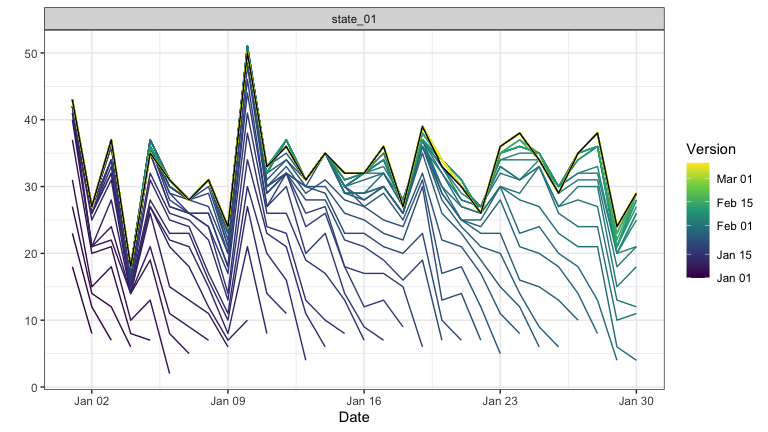
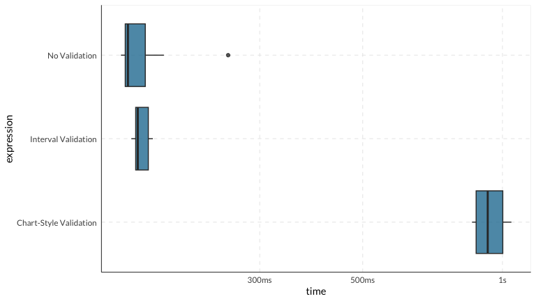

# linelist_to_archive Benchmarks


This benchmark evaluates `linelist_to_archive()` performance.

``` r
# Load packages
devtools::load_all("..")

pacman::p_load(tidyverse, janitor, bench, epidatr)
```

## Synthetic Linelist Data

Create linelist data of different sizes to benchmark scaling behavior.

``` r
generate_linelist <- function(n_events, n_geos = 5, date_range_days = 365) {

  # Scenario: constant flow of cases over 50 days
  days <- seq(as.Date("2023-01-01"), by = "day", length.out = date_range_days)
  geos <- paste0("state_", sprintf("%02d", 1:n_geos))

  # Generate cases
  cases <- tibble(
    id = 1:n_events,
    geo_value = sample(geos, n_events, replace = TRUE),
    # random day in the range
    time_value = sample(days, n_events, replace = TRUE),
    # most reported quickly, some late
    lag_rec = rgeom(n_events, 0.2),
    # cases later deleted
    is_deletion = runif(n_events) < 0.02,
    lag_del = rgeom(n_events, 0.1)
  ) %>%
    mutate(
      version_recorded = time_value + lag_rec,
      # Deleted some time after recording
      version_deleted = if_else(is_deletion, version_recorded + lag_del + 1, as.Date(NA))
    )

  linelist <- cases %>%
    select(id, geo_value, time_value, version_recorded, version_deleted) %>%
    arrange(version_recorded)
  
  linelist
}
```

``` r
# One example
set.seed(42)

linelist <- generate_linelist(1000, 1, 30)

ea <- linelist_to_archive(
    linelist,
    geo_value = geo_value,
    time_value = time_value,
    version_recorded = version_recorded,
    version_deleted = version_deleted,
    id = id,
    value = "cases"
  )

autoplot(ea)
```



## Benchmark Results

### Scaling with Dataset Size

It is tested across 1K, 10K, and 50K datasets.

``` r
# Dataset
linelist_small <- generate_linelist(1000)

linelist_medium <- generate_linelist(10000)

linelist_large <- generate_linelist(50000)

inputs <- list(
  small = linelist_small,
  medium = linelist_medium,
  large = linelist_large
)

# Run benchmark
scaling_bench <- bench::press(
  size = names(inputs),
  {
    dat <- inputs[[size]]
    bench::mark(
      linelist_to_archive(
        dat,
        geo_value = geo_value,
        time_value = time_value,
        version_recorded = version_recorded,
        version_deleted = version_deleted,
        id = id
      ),
      iterations = 5,
      check = FALSE
    )
  }
)

# Summary
scaling_bench %>%
  select(size, median, mem_alloc, n_itr) %>%
  arrange(median)
```

    #> # A tibble: 3 × 3
    #>   size     median mem_alloc
    #>   <chr>  <bch:tm> <bch:byt>
    #> 1 small    36.4ms    2.61MB
    #> 2 medium   73.4ms    6.99MB
    #> 3 large   159.4ms   19.61MB

### Cost of ID Validation

We compare `linelist_to_archive()` with different validation modes using
a 50K rows dataset.

``` r
# Helper to convert to chart-style
convert_to_chart_style <- function(df) {
  # All original rows become "recording" events
  recs <- df %>%
    mutate(is_deletion = FALSE) %>%
    rename(.version = version_recorded) %>%
    select(-version_deleted)
  
  # Rows with version_deleted become additional "deletion" events
  # These need the same data, but with the deletion version and is_deletion = TRUE
  dels <- df %>%
    filter(!is.na(version_deleted)) %>%
    mutate(
      is_deletion = TRUE,
      .version = version_deleted
    ) %>%
    select(-version_recorded, -version_deleted)
  
  # Combine and rename back
  bind_rows(recs, dels) %>%
    rename(version_recorded = .version) %>%
    arrange(version_recorded, is_deletion)
}

linelist_chart <- convert_to_chart_style(linelist_large)

validation_bench <- bench::mark(
  "No Validation" = linelist_to_archive(
    linelist_large,
    geo_value = geo_value,
    time_value = time_value,
    version_recorded = version_recorded,
    version_deleted = version_deleted,
    id = NULL
  ),
  "Interval Validation" = linelist_to_archive(
    linelist_large,
    geo_value = geo_value,
    time_value = time_value,
    version_recorded = version_recorded,
    version_deleted = version_deleted,
    id = id # validation on
  ),
  "Chart-Style Validation" = linelist_to_archive(
    linelist_chart,
    geo_value = geo_value,
    time_value = time_value,
    version_recorded = version_recorded,
    is_deletion = is_deletion, # Chart-style
    id = id # validation on
  ),
  iterations = 10,
  check = FALSE
)

# Summary
validation_bench %>%
  select(expression, median, mem_alloc, n_itr)
```

    #> # A tibble: 3 × 3
    #>   expression               median mem_alloc
    #>   <bch:expr>             <bch:tm> <bch:byt>
    #> 1 No Validation             154ms    18.7MB
    #> 2 Interval Validation       156ms    19.6MB
    #> 3 Chart-Style Validation    856ms    33.5MB

``` r
# Plot
plot(validation_bench, type = "boxplot")
```



## Session Info

``` r
sessionInfo()
```

    #> R version 4.5.1 (2025-06-13)
    #> Platform: aarch64-apple-darwin20
    #> Running under: macOS Tahoe 26.2
    #> 
    #> Matrix products: default
    #> BLAS:   /Library/Frameworks/R.framework/Versions/4.5-arm64/Resources/lib/libRblas.0.dylib 
    #> LAPACK: /Library/Frameworks/R.framework/Versions/4.5-arm64/Resources/lib/libRlapack.dylib;  LAPACK version 3.12.1
    #> 
    #> locale:
    #> [1] es_ES.UTF-8/es_ES.UTF-8/es_ES.UTF-8/C/es_ES.UTF-8/en_US.UTF-8
    #> 
    #> time zone: America/Vancouver
    #> tzcode source: internal
    #> 
    #> attached base packages:
    #> [1] stats     graphics  grDevices utils     datasets  methods   base     
    #> 
    #> other attached packages:
    #>  [1] epidatr_1.2.1          bench_1.1.4            janitor_2.2.1         
    #>  [4] lubridate_1.9.4        forcats_1.0.1          stringr_1.6.0         
    #>  [7] dplyr_1.1.4            purrr_1.2.1            readr_2.1.5           
    #> [10] tidyr_1.3.2            tibble_3.3.1           tidyverse_2.0.0       
    #> [13] epiprocess_0.12.0.9999 testthat_3.3.0         epidatasets_0.0.3     
    #> [16] mytidyfunctions_0.1    ggplot2_4.0.1          devtools_2.4.6        
    #> [19] usethis_3.2.1          pacman_0.5.1          
    #> 
    #> loaded via a namespace (and not attached):
    #>  [1] gtable_0.3.6       anytime_0.3.12     xfun_0.54          remotes_2.5.0     
    #>  [5] tsibble_1.1.6      tzdb_0.5.0         vctrs_0.7.0.9000   tools_4.5.1       
    #>  [9] generics_0.1.4     pkgconfig_2.0.3    data.table_1.17.8  checkmate_2.3.3   
    #> [13] RColorBrewer_1.1-3 S7_0.2.1           desc_1.4.3         lifecycle_1.0.5   
    #> [17] compiler_4.5.1     farver_2.1.2       brio_1.1.5         snakecase_0.11.1  
    #> [21] htmltools_0.5.8.1  yaml_2.3.12        profmem_0.7.0      pillar_1.11.1     
    #> [25] ellipsis_0.3.2     openssl_2.3.4      cachem_1.1.0       sessioninfo_1.2.3 
    #> [29] tidyselect_1.2.1   digest_0.6.38      stringi_1.8.7      labeling_0.4.3    
    #> [33] rprojroot_2.1.1    fastmap_1.2.0      grid_4.5.1         cli_3.6.5         
    #> [37] magrittr_2.0.4     utf8_1.2.6         pkgbuild_1.4.8     withr_3.0.2       
    #> [41] waldo_0.6.2        scales_1.4.0       backports_1.5.0    warp_0.2.2        
    #> [45] timechange_0.3.0   httr_1.4.7         rmarkdown_2.30     slider_0.3.3      
    #> [49] askpass_1.2.1      hms_1.1.4          memoise_2.0.1      evaluate_1.0.5    
    #> [53] knitr_1.50         viridisLite_0.4.2  rlang_1.1.7        Rcpp_1.1.1        
    #> [57] glue_1.8.0         xml2_1.4.1         pkgload_1.4.1      rstudioapi_0.17.1 
    #> [61] jsonlite_2.0.0     R6_2.6.1           fs_1.6.6           MMWRweek_0.1.3
