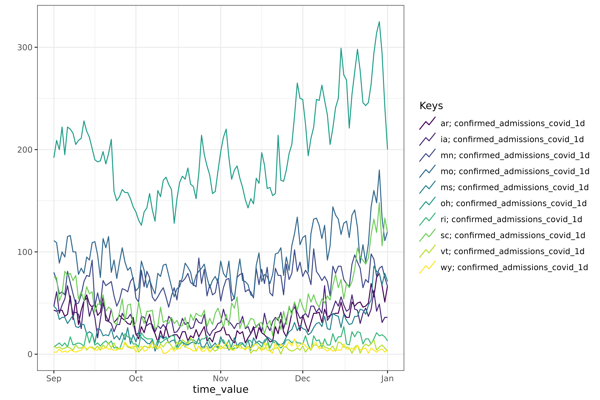
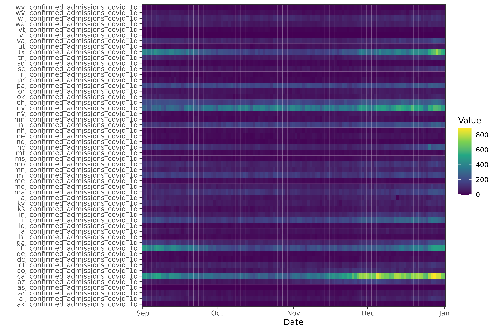
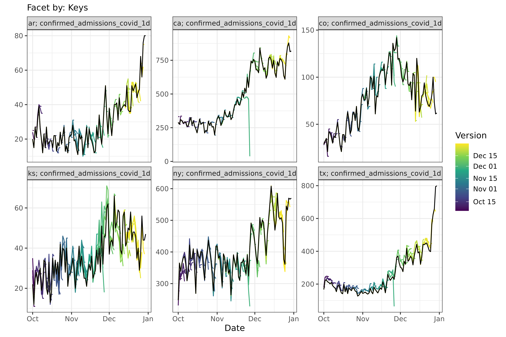
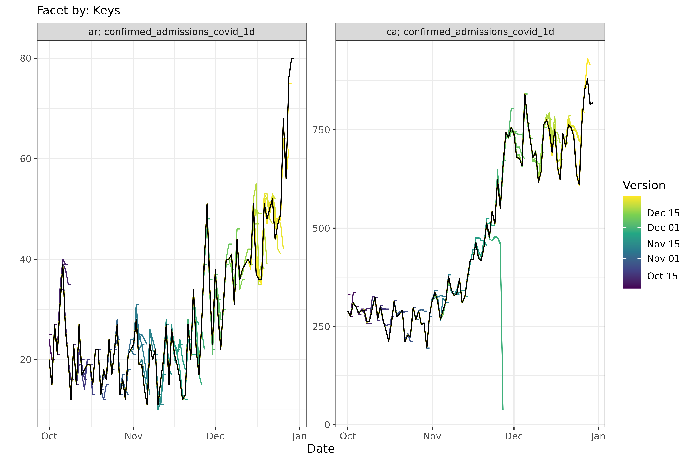

# Advanced Plotting with epiprocess

The [epiprocess](https://github.com/cmu-delphi/epiprocess) package
provides advanced visualization capabilities for both `epi_df` and
`epi_archive` objects.

``` r
library(epidatr)
library(epiprocess)
library(dplyr)
library(tidyr)
library(ggplot2)
set.seed(123)
```

## Static Plotting with Many Keys

When plotting an `epi_df` with a large number of key combinations (e.g.,
all US states), [epiprocess](https://github.com/cmu-delphi/epiprocess)
automatically subsamples the keys to keep the plot readable and
performant. You can control this behavior with the `.max_keys` argument
(e.g., set it to `Inf` to display all keys).

``` r
# Fetching HHS admissions for all states
df <- pub_covidcast(
  source = "hhs",
  signals = "confirmed_admissions_covid_1d",
  geo_type = "state",
  time_type = "day",
  geo_values = "*",
  time_values = epirange(20220901, 20230101)
) %>%
  as_epi_df()
#> Waiting 4s for retry backoff ■■■■■■■■■                       
#> Waiting 4s for retry backoff ■■■■■■■■■■■■■■■■■■■■■■■■■■■■■■  
#> Keeping this data in "long" format, with `signal` and `value` columns.
#> → To convert to wide format with a(n) `confirmed_admissions_covid_1d` column
#>   instead, pass `signal_format = "wide"` instead.
#> → Silence with `signal_format = "long"`
#> Adding `signal` to `other_keys`.

# Static plot with many keys (subsampling will occur)
autoplot(
  df, value
)
#> Warning: Too many key combinations to display clearly. Showing 10 of 54.
#> → To plot all keys, use `autoplot(..., .max_keys = Inf)`.
#> → To explore all keys interactively, use `autoplot(..., .interactive =
#>   TRUE)`.
```



## Heatmaps

You can visualize `epi_df` objects as heatmaps using
[`plot_heatmap()`](https://cmu-delphi.github.io/epiprocess/dev/reference/plot_heatmap.md).
This is particularly useful for visualizing values across many locations
simultaneously.

``` r
# Static heatmap for a single variable
plot_heatmap(df, value)
```



## Interactive Plotting

For interactive exploration of data, you can set `.interactive = TRUE`
in
[`autoplot()`](https://ggplot2.tidyverse.org/reference/autoplot.html).
This returns a `plotly` widget, allowing you to hover over data points
or isolate certain lines.

``` r
# Interactive plot for a single variable
autoplot(
  df, value,
  .interactive = TRUE
)
#> Plotting 54 keys can be hard to read.
#> ℹ Showing a random subset of 10 keys by default.
#> → Select additional keys in the legend on the right.
#> → To see all keys, set `.max_keys = Inf` or use `plotly::style(p, visible =
#>   TRUE)`.
```

``` r

# Interactive plot with facets
autoplot(
  df, value,
  .interactive = TRUE,
  .facet_by = "geo_value",
  .facet_filter = geo_value %in% c("ar", "ca", "ny", "tx", "il", "mi")
)
```

### Interactive Dropdowns

When you have many facets, they can take up a lot of space. Setting
`.facet_to_dropdown = TRUE` along with `.interactive = TRUE` collapses
the facets into a single plot with a dropdown menu.

``` r
# Dropdown for geographic locations
autoplot(df, value,
  .interactive = TRUE,
  .facet_by = "geo_value",
  .facet_to_dropdown = TRUE
)
```

You can also combine faceting and dropdowns for more complex data
exploration. For example, dropdown by one key and facet by another:

``` r
# Synthetic data with multiple keys
df2 <- expand.grid(
  geo_value = c("ca", "ny", "tx"),
  time_value = as.Date("2023-01-01") + 0:30,
  other = c("source_a", "source_b")
) %>%
  dplyr::mutate(cases = rnorm(dplyr::n())) %>%
  as_epi_df(other_keys = "other")

# Dropdown by 'other' key, facet by 'geo_value'
autoplot(df2, cases,
  .facet_by = "geo_value",
  .facet_to_dropdown = TRUE,
  .interactive = TRUE
)
```

## Plotting `epi_archive` Objects

`epi_archive` objects can also be visualized with
[`autoplot()`](https://ggplot2.tidyverse.org/reference/autoplot.html).
This allows you to visualize how data appeared at different points in
time (versions).

``` r
# Fetch HHS admissions with version history
df_versions <- pub_covidcast(
  source = "hhs",
  signals = "confirmed_admissions_covid_1d",
  geo_type = "state",
  time_type = "day",
  geo_values = "ar,ia,ca,ny,tx,ks,co",
  time_values = epirange(20221001, 20230101),
  issues = epirange(20221001, 20230101)
) %>%
  rename(version = issue) %>%
  as_epi_archive()
#> Waiting 4s for retry backoff ■■■■■■■■                        
#> Waiting 4s for retry backoff ■■■■■■■■■■■■■                   
#> Waiting 4s for retry backoff ■■■■■■■■■■■■■■■■■■■■■■■■■■■■■■  
#> Keeping this data in "long" format, with `signal` and `value` columns.
#> → To convert to wide format with a(n) `confirmed_admissions_covid_1d` column
#>   instead, pass `signal_format = "wide"` instead.
#> → Silence with `signal_format = "long"`
#> Adding `signal` to `other_keys`.

# Static epi_archive plot showing all captured versions
autoplot(df_versions, value)
#> Warning: Too many key combinations to display clearly. Showing 6 of 7.
#> → To plot all keys, use `autoplot(..., .max_keys = Inf)`.
#> → To explore all keys interactively, use `autoplot(..., .interactive =
#>   TRUE)`.
#> → To plot specific keys, use `autoplot(..., .facet_filter = ...)`.
```



``` r

# Static epi_archive plot with filtering
autoplot(
  df_versions, value,
  .facet_filter = geo_value %in% c("ar", "ca")
)
```



Interactive plots for archives also support the dropdown feature, which
can be useful for selecting a specific location or key.

``` r
# Archive plot with dropdown for states
autoplot(
  df_versions, value,
  .interactive = TRUE,
  .facet_to_dropdown = TRUE,
  .facet_filter = geo_value %in% c("ar", "ca")
)
```
