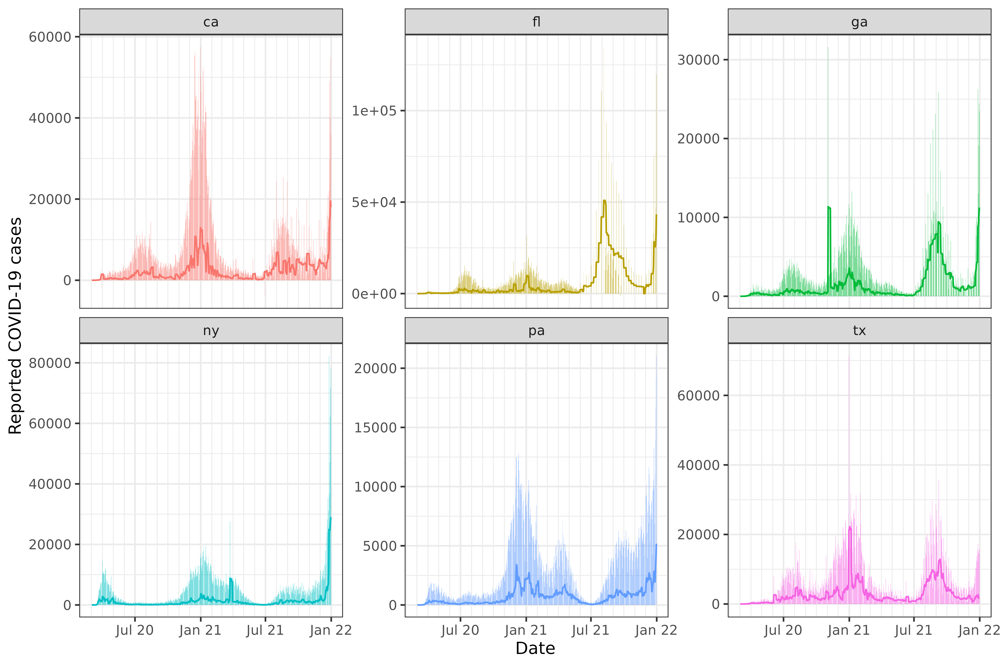
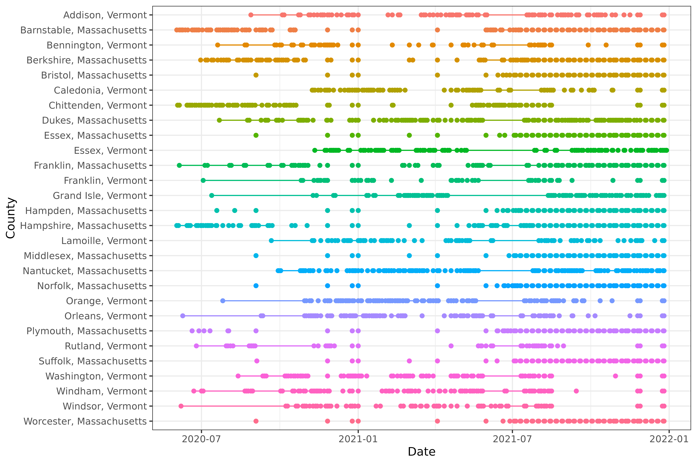

# Working with epi_df objects and time series data

The `epi_df` data structure provided by `epiprocess` provides convenient
ways to perform common processing tasks. In this vignette, we will:

- construct an `epi_df` from a data frame
- perform rolling time-window computations using
  [`epi_slide()`](https://cmu-delphi.github.io/epiprocess/dev/reference/epi_slide.md)
- perform group-level aggregation using
  [`sum_groups_epi_df()`](https://cmu-delphi.github.io/epiprocess/dev/reference/sum_groups_epi_df.md)
- detect and fill time gaps using
  [`complete.epi_df()`](https://cmu-delphi.github.io/epiprocess/dev/reference/complete.epi_df.md)
  and [tsibble](https://tsibble.tidyverts.org)
- perform geographic aggregation (not yet implemented)

## Getting data into `epi_df` format

As in
[`vignette("epiprocess")`](https://cmu-delphi.github.io/epiprocess/dev/articles/epiprocess.md),
we will fetch daily reported COVID-19 cases from CA, FL, NY, and TX
(note: here we’re using new, not cumulative cases) using the
[`epidatr`](https://github.com/cmu-delphi/epidatr) package, and then
convert this to `epi_df` format.

``` r
library(epiprocess)
library(dplyr)
```

The data is included in the [`epidatasets`
package](https://cmu-delphi.github.io/epidatasets/), which is loaded
along with `epiprocess`, and can be accessed with:

``` r
edf <- cases_deaths_subset %>%
  select(geo_value, time_value, cases) %>%
  arrange(geo_value, time_value)
```

The data can also be fetched from the Delphi Epidata API with the
following query:

``` r
library(epidatr)

d <- as.Date("2024-03-20")

edf <- pub_covidcast(
  source = "jhu-csse",
  signals = "confirmed_incidence_num",
  geo_type = "state",
  time_type = "day",
  geo_values = "ca,fl,ny,tx,ga,pa",
  time_values = epirange(20200301, 20211231),
  as_of = d
) %>%
  select(geo_value, time_value, cases = value) %>%
  arrange(geo_value, time_value) %>%
  as_epi_df(as_of = d)
```

The data has 2,684 rows and 3 columns.

## Rolling computations using `epi_slide`

A very common operation in time series processing is aggregating the
values of the time series by applying some function on a rolling time
window of data points. The key tool that allows this is
[`epi_slide()`](https://cmu-delphi.github.io/epiprocess/dev/reference/epi_slide.md).
The function always first makes sure to group the data by the grouping
variables of the `epi_df` object, which includes the `geo_value` and
possibly `other_keys` columns. It then applies the rolling slide
computation inside each group.

The
[`epi_slide()`](https://cmu-delphi.github.io/epiprocess/dev/reference/epi_slide.md)
function has three ways to specify the computation to be performed:

- by using a tidy evaluation approach
- by passing a formula
- by passing a function

### Slide the tidy way

Usually, the most convenient way to setup a computation in
[`epi_slide()`](https://cmu-delphi.github.io/epiprocess/dev/reference/epi_slide.md)
is to pass in an expression for tidy evaluation. In this case, we can
simply define the name of the new column directly as part of the
expression, setting it equal to a computation in which we can access any
columns of `.x` by name, just as we would in a call to, say,
[`dplyr::mutate()`](https://dplyr.tidyverse.org/reference/mutate.html).
For example:

``` r
slide_output <- edf %>%
  epi_slide(cases_7sd = sd(cases, na.rm = TRUE), .window_size = 7)
```

As a simple sanity check, we visualize the 7-day trailing averages
computed on top of the original counts:

``` r
library(ggplot2)

ggplot(slide_output, aes(x = time_value)) +
  geom_col(aes(y = cases, fill = geo_value), alpha = 0.5, show.legend = FALSE) +
  geom_line(aes(y = cases_7sd, col = geo_value), show.legend = FALSE) +
  facet_wrap(~geo_value, scales = "free_y") +
  scale_x_date(minor_breaks = "month", date_labels = "%b %y") +
  labs(x = "Date", y = "Reported COVID-19 cases")
```



As we can see from the Texas plot, the state moved to weekly reporting
of COVID-19 cases in summer of 2021.

Note that without
[`epi_slide()`](https://cmu-delphi.github.io/epiprocess/dev/reference/epi_slide.md),
the computation is much less convenient. For instance, a rough
equivalent of the above computation would be the following, which is
easy to get wrong:

``` r
edf %>%
  complete(geo_value, time_value = seq.Date(min(time_value), max(time_value), by = "day")) %>%
  arrange_canonical() %>%
  group_by(geo_value) %>%
  mutate(cases_7sd = slider::slide_dbl(cases, .f = sd, na.rm = TRUE, .before = 7, .after = 0)) %>%
  ungroup()
#> An `epi_df` object, 4,026 x 4 with metadata:
#> * geo_type  = state
#> * time_type = day
#> * as_of     = 2024-03-20
#> 
#> # A tibble: 4,026 × 4
#>   geo_value time_value cases cases_7sd
#>   <chr>     <date>     <dbl>     <dbl>
#> 1 ca        2020-03-01     6     NA   
#> 2 ca        2020-03-02     4      1.41
#> 3 ca        2020-03-03     6      1.15
#> 4 ca        2020-03-04    11      2.99
#> 5 ca        2020-03-05    10      2.97
#> 6 ca        2020-03-06    18      5.08
#> # ℹ 4,020 more rows
```

Furthermore
[`epi_slide()`](https://cmu-delphi.github.io/epiprocess/dev/reference/epi_slide.md)
allows for selecting `.ref_time_value`, which the latter recipe does not
support.

### Slide with a function

We can also pass a function to the second argument in
[`epi_slide()`](https://cmu-delphi.github.io/epiprocess/dev/reference/epi_slide.md).
In this case, the passed function `.f` must have the form
`function(x, g, t, ...)`, where

- `x` is an epi_df with the same column names as the input epi_df
- `g` is a one-row tibble containing the values of the grouping
  variables for the associated group, for instance `g$geo_value`
- `t` is the ref_time_value for the current window
- `...` (optional) are any additional arguments you’d like to be able to
  forward to your function

The same computation as above can be done with a function:

``` r
edf %>%
  epi_slide(.f = function(x, g, t) sd(x$cases, na.rm = TRUE), .window_size = 7)
#> An `epi_df` object, 4,026 x 4 with metadata:
#> * geo_type  = state
#> * time_type = day
#> * as_of     = 2024-03-20
#> 
#> # A tibble: 4,026 × 4
#>   geo_value time_value cases slide_value
#>   <chr>     <date>     <dbl>       <dbl>
#> 1 ca        2020-03-01     6       NA   
#> 2 ca        2020-03-02     4        1.41
#> 3 ca        2020-03-03     6        1.15
#> 4 ca        2020-03-04    11        2.99
#> 5 ca        2020-03-05    10        2.97
#> 6 ca        2020-03-06    18        5.08
#> # ℹ 4,020 more rows
```

### `epi_slide()` with a formula

The same computation as above can be done with a formula, where all
references to the columns must be made with the prefix `.x$...`, for
instance:

``` r
edf %>%
  epi_slide(~ sd(.x$cases, na.rm = TRUE), .window_size = 7)
#> An `epi_df` object, 4,026 x 4 with metadata:
#> * geo_type  = state
#> * time_type = day
#> * as_of     = 2024-03-20
#> 
#> # A tibble: 4,026 × 4
#>   geo_value time_value cases slide_value
#>   <chr>     <date>     <dbl>       <dbl>
#> 1 ca        2020-03-01     6       NA   
#> 2 ca        2020-03-02     4        1.41
#> 3 ca        2020-03-03     6        1.15
#> 4 ca        2020-03-04    11        2.99
#> 5 ca        2020-03-05    10        2.97
#> 6 ca        2020-03-06    18        5.08
#> # ℹ 4,020 more rows
```

Note that the name of the column defaults to `slide_value` in the
unnamed formula or function case. This can be adjusted with
`.new_col_name`.

### Rolling computations with multiple column outputs

If your formula (or function) returns a tibble (or other kind of data
frame), then its columns will be unpacked into the resulting `epi_df`
(in the sense of
[`tidyr::unpack()`](https://tidyr.tidyverse.org/reference/pack.html)).
For example, the following computes the 7-day trailing average of daily
cases as well as the the 7-day trailing standard deviation of daily
cases:

``` r
edf %>%
  epi_slide(
    ~ tibble(
      cases_mean = mean(.x$cases, na.rm = TRUE),
      cases_sd = sd(.x$cases, na.rm = TRUE)
    ),
    .window_size = 7
  )
#> An `epi_df` object, 4,026 x 5 with metadata:
#> * geo_type  = state
#> * time_type = day
#> * as_of     = 2024-03-20
#> 
#> # A tibble: 4,026 × 5
#>   geo_value time_value cases cases_mean cases_sd
#>   <chr>     <date>     <dbl>      <dbl>    <dbl>
#> 1 ca        2020-03-01     6       6       NA   
#> 2 ca        2020-03-02     4       5        1.41
#> 3 ca        2020-03-03     6       5.33     1.15
#> 4 ca        2020-03-04    11       6.75     2.99
#> 5 ca        2020-03-05    10       7.4      2.97
#> 6 ca        2020-03-06    18       9.17     5.08
#> # ℹ 4,020 more rows
```

### Optimized rolling mean and sums

For the two most common sliding operations, we offer two optimized
versions:
[`epi_slide_mean()`](https://cmu-delphi.github.io/epiprocess/dev/reference/epi_slide_opt.md)
and
[`epi_slide_sum()`](https://cmu-delphi.github.io/epiprocess/dev/reference/epi_slide_opt.md).
These are much faster than
[`epi_slide()`](https://cmu-delphi.github.io/epiprocess/dev/reference/epi_slide.md),
so we recommend using them when you are only interested in the mean or
sum of a column. The following computes the 7-day trailing mean of daily
cases, allowing means and sums to be taken over fewer than 7
observations if there is missingness (`na.rm = TRUE`):

``` r
edf %>%
  epi_slide_mean("cases", .window_size = 7, na.rm = TRUE)
#> An `epi_df` object, 4,026 x 4 with metadata:
#> * geo_type  = state
#> * time_type = day
#> * as_of     = 2024-03-20
#> 
#> # A tibble: 4,026 × 4
#>   geo_value time_value cases cases_7dav
#>   <chr>     <date>     <dbl>      <dbl>
#> 1 ca        2020-03-01     6       6   
#> 2 ca        2020-03-02     4       5   
#> 3 ca        2020-03-03     6       5.33
#> 4 ca        2020-03-04    11       6.75
#> 5 ca        2020-03-05    10       7.4 
#> 6 ca        2020-03-06    18       9.17
#> # ℹ 4,020 more rows
edf %>%
  epi_slide_sum("cases", .window_size = 7, na.rm = TRUE)
#> An `epi_df` object, 4,026 x 4 with metadata:
#> * geo_type  = state
#> * time_type = day
#> * as_of     = 2024-03-20
#> 
#> # A tibble: 4,026 × 4
#>   geo_value time_value cases cases_7dsum
#>   <chr>     <date>     <dbl>       <dbl>
#> 1 ca        2020-03-01     6           6
#> 2 ca        2020-03-02     4          10
#> 3 ca        2020-03-03     6          16
#> 4 ca        2020-03-04    11          27
#> 5 ca        2020-03-05    10          37
#> 6 ca        2020-03-06    18          55
#> # ℹ 4,020 more rows
```

### Running a forecaster on a sliding window of data

The natural next step is to use the sliding window to forecast future
values. However to do this correctly, we should make sure that our data
is historically accurate. The data structure we use for that is the
`epi_archive` and the analogous slide function is
[`epix_slide()`](https://cmu-delphi.github.io/epiprocess/dev/reference/epix_slide.md).
To read further along this train of thought, see
[`vignette("epi_archive")`](https://cmu-delphi.github.io/epiprocess/dev/articles/epi_archive.md).

## Adding more keys to an `epi_df` and aggregating groups with `sum_groups_epi_df`

An `epi_df` object can have more key columns than just `geo_value` and
`time_value`. For example, if we have demographic attributes like age
group, we can add this as a key column. We can then aggregate the data
by these key columns using
[`sum_groups_epi_df()`](https://cmu-delphi.github.io/epiprocess/dev/reference/sum_groups_epi_df.md).
Let’s use influenza hospitalization rate data from the CDC system
FluSurv as an example. We can get it from the [Delphi Epidata
API](https://cmu-delphi.github.io/delphi-epidata/api/flusurv.html).

``` r
library(epidatr)
flu_data_api <- pub_flusurv(
  locations = "ca",
  epiweeks = epirange(201801, 202001)
)
```

We’re interested in the age-specific rates:

``` r
flu_data <- flu_data_api %>%
  select(location, epiweek, rate_age_0, rate_age_1, rate_age_2, rate_age_3, rate_age_4) %>%
  # Turn `rate_age_0`..`rate_age_4` columns into an `age_group` and `rate`
  # column (with 5x as many rows):
  tidyr::pivot_longer(
    cols = starts_with("rate_age_"), names_to = "age_group", values_to = "rate",
    # When converting column names to entries in `age_group`, remove this prefix:
    names_prefix = "rate_age_",
    # And add a better prefix:
    names_transform = function(age_group) paste0("age_group_", age_group)
  ) %>%
  # Improve `age_group` labels a bit more:
  mutate(
    age_group = case_match(
      age_group,
      "age_group_0" ~ "0--4 yr",
      "age_group_1" ~ "5--17 yr",
      "age_group_2" ~ "18--49 yr",
      "age_group_3" ~ "50--64 yr",
      "age_group_4" ~ ">= 65 yr",
      # Make this a factor with appropriate level ordering:
      .ptype = factor(levels = c(
        "0--4 yr", "5--17 yr", "18--49 yr",
        "50--64 yr", ">= 65 yr"
      ))
    )
  ) %>%
  # The API currently outputs `epiweek` in Date format (the constituent Sunday);
  # rename it to remind us that it's not in YYYYww format:
  rename(time_value = epiweek)
#> Warning: There was 1 warning in `mutate()`.
#> ℹ In argument: `age_group = case_match(...)`.
#> Caused by warning:
#> ! `case_match()` was deprecated in dplyr 1.2.0.
#> ℹ Please use `recode_values()` instead.
flu_data
#> # A tibble: 305 × 4
#>   location time_value age_group  rate
#>   <chr>    <date>     <fct>     <dbl>
#> 1 CA       2017-12-31 0--4 yr     4.4
#> 2 CA       2017-12-31 5--17 yr    1.7
#> 3 CA       2017-12-31 18--49 yr   2.7
#> 4 CA       2017-12-31 50--64 yr  18.7
#> 5 CA       2017-12-31 >= 65 yr   99.7
#> 6 CA       2018-01-07 0--4 yr     4.4
#> # ℹ 299 more rows
```

We can now convert this data to an `epi_df` object and set the
`age_group` column as an additional group key:

``` r
flu_data <- flu_data %>% as_epi_df(other_keys = "age_group")
#> inferring geo_value column.
flu_data
#> An `epi_df` object, 305 x 4 with metadata:
#> * geo_type  = state
#> * time_type = week
#> * other_keys = age_group
#> * as_of     = 2026-02-10 07:27:32.403611
#> 
#> # A tibble: 305 × 4
#>   geo_value age_group time_value  rate
#> * <chr>     <fct>     <date>     <dbl>
#> 1 CA        0--4 yr   2017-12-31   4.4
#> 2 CA        5--17 yr  2017-12-31   1.7
#> 3 CA        18--49 yr 2017-12-31   2.7
#> 4 CA        50--64 yr 2017-12-31  18.7
#> 5 CA        >= 65 yr  2017-12-31  99.7
#> 6 CA        0--4 yr   2018-01-07   4.4
#> # ℹ 299 more rows
```

Note that the `epi_df` object now has an additional key column
`age_group`. This means that there should only be one row for each
combination of `geo_value`, `age_group`, and `time_value` in the dataset
(this is enforced at construction time).

Now we can aggregate the data by `age_group`, if we want to compute the
total. For count data, this would be just a single call to
[`sum_groups_epi_df()`](https://cmu-delphi.github.io/epiprocess/dev/reference/sum_groups_epi_df.md).
Since we are working with rates, we need to attach some population data
in order to do this aggregation. It’s somewhat ambiguous whether
FluSurv-NET reporting uses either
[NCHS](https://www.cdc.gov/nchs/nvss/bridged_race.htm) or
[Census](https://www.census.gov/programs-surveys/popest/technical-documentation/research/evaluation-estimates/2020-evaluation-estimates/2010s-county-detail.html)
populations for `time_value`s before 2020 included in reports published
in 2020 onward, but at least for this example, these two sources agree
exactly. FluSurv-NET also directly reports an overall rate, so we can
check our work.

``` r
# Population estimates for FluSurv-NET-covered part of CA on 2017-07-01 and
# 2018-07-01, extracted and aggregated from "vintage 2020" estimates (actually
# released by Census in June 2021 and by NCHS in September 2021), which is the
# last available reporting found with population estimates for 2017 and 2018:
pop <- tribble(
  ~geo_value, ~age_group,  ~time_value,           ~pop,
  "CA",       "0--4 yr",   as.Date("2017-07-01"), 203813,
  "CA",       "5--17 yr",  as.Date("2017-07-01"), 521827,
  "CA",       "18--49 yr", as.Date("2017-07-01"), 1722399,
  "CA",       "50--64 yr", as.Date("2017-07-01"), 700090,
  "CA",       ">= 65 yr",  as.Date("2017-07-01"), 534789,
  "CA",       "0--4 yr",   as.Date("2018-07-01"), 201265,
  "CA",       "5--17 yr",  as.Date("2018-07-01"), 520077,
  "CA",       "18--49 yr", as.Date("2018-07-01"), 1725382,
  "CA",       "50--64 yr", as.Date("2018-07-01"), 699145,
  "CA",       ">= 65 yr",  as.Date("2018-07-01"), 551243,
)
# Calculate fraction of total population in each age group.
pop <- pop %>%
  group_by(geo_value, time_value) %>%
  mutate(frac_pop = pop / sum(pop)) %>%
  ungroup()
```

After joining population onto the rate data, we can calculate the
population-weighted rate for each age group, that is, the portion of
each `age_group`’s rate that it contributes to the overall rate.

``` r
fractional_rate_by_age_group <-
  flu_data %>%
  inner_join(
    pop,
    # Simple population interpolation/extrapolation scheme: last observation
    # carried forward. Use the estimated population on 2017-07-01 for
    # time_values 2017-07-01 through 2018-06-30, and the estimated population on
    # 2018-07-01 for all subsequent time_values:
    join_by(geo_value, age_group, closest(y$time_value <= x$time_value)),
    # Generate errors if the two data sets don't line up as expected:
    relationship = "many-to-one", unmatched = "error",
    # We'll get a second time column indicating which population estimate
    # was carried forward; name it time_value_for_pop:
    suffix = c("", "_for_pop")
  ) %>%
  mutate(rate_contrib = rate * frac_pop)
```

We can then use `sum_groups_epi_df` to sum population-weighted rate
across all age groups to get the overall rate.

``` r
rate_overall_recalc_edf <-
  fractional_rate_by_age_group %>%
  sum_groups_epi_df("rate_contrib", group_cols = c("geo_value")) %>%
  rename(rate_overall_recalc = rate_contrib) %>%
  # match rounding of original data:
  mutate(rate_overall_recalc = round(rate_overall_recalc, 1))
rate_overall_recalc_edf
#> An `epi_df` object, 61 x 3 with metadata:
#> * geo_type  = state
#> * time_type = week
#> * as_of     = 2026-02-10 07:27:32.403611
#> 
#> # A tibble: 61 × 3
#>   geo_value time_value rate_overall_recalc
#>   <chr>     <date>                   <dbl>
#> 1 CA        2017-12-31                19.8
#> 2 CA        2018-01-07                12  
#> 3 CA        2018-01-14                 9  
#> 4 CA        2018-01-21                 6.1
#> 5 CA        2018-01-28                 4.7
#> 6 CA        2018-02-04                 3.4
#> # ℹ 55 more rows
```

Let’s compare our calculated rate to the overall rate reported by
FluSurv-NET.

``` r
rate_overall_recalc_edf <-
  rate_overall_recalc_edf %>%
  # compare to published overall rates:
  inner_join(
    flu_data_api %>%
      select(geo_value = location, time_value = epiweek, rate_overall),
    by = c("geo_value", "time_value"),
    # validate that we have exactly the same set of geo_value x time_value combinations:
    relationship = "one-to-one", unmatched = "error"
  )
# What's our maximum error vs. the official overall estimates?
max(abs(rate_overall_recalc_edf$rate_overall - rate_overall_recalc_edf$rate_overall_recalc))
#> [1] 0.1
```

This small amount of difference is expected, since all the age-specific
rates were rounded to the first decimal place, and population data might
have been interpolated and extrapolated a bit differently in the
official source, limiting our ability to precisely recreate its
estimates from an age group breakdown.

## Detecting and filling time gaps with `complete.epi_df`

Sometimes you may have missing data in your time series. This can be due
to actual missing data, or it can be due to the fact that the data is
only reported on certain days. In the latter case, it is often useful to
fill in the missing data with explicit zeros. This can be done with the
[`complete.epi_df()`](https://cmu-delphi.github.io/epiprocess/dev/reference/complete.epi_df.md)
function.

First, let’s create a data set with some missing data. We will reuse the
dataset `edf` from above, but modify it slightly.

``` r
edf_missing <- edf %>%
  filter(geo_value %in% c("ca", "tx")) %>%
  group_by(geo_value) %>%
  slice(1:3, 5:6) %>%
  ungroup()

edf_missing %>%
  print(n = 10)
#> An `epi_df` object, 10 x 3 with metadata:
#> * geo_type  = state
#> * time_type = day
#> * as_of     = 2024-03-20
#> 
#> # A tibble: 10 × 3
#>    geo_value time_value cases
#>    <chr>     <date>     <dbl>
#>  1 ca        2020-03-01     6
#>  2 ca        2020-03-02     4
#>  3 ca        2020-03-03     6
#>  4 ca        2020-03-05    10
#>  5 ca        2020-03-06    18
#>  6 tx        2020-03-01     0
#>  7 tx        2020-03-02     0
#>  8 tx        2020-03-03     0
#>  9 tx        2020-03-05     3
#> 10 tx        2020-03-06     1
```

Now let’s fill in the missing data with explicit zeros:

``` r
edf_missing <- edf_missing %>%
  group_by(geo_value) %>%
  complete(
    time_value = seq.Date(min(time_value), max(time_value), by = "day"),
    fill = list(cases = 0)
  ) %>%
  ungroup()

edf_missing %>%
  print(n = 12)
#> An `epi_df` object, 12 x 3 with metadata:
#> * geo_type  = state
#> * time_type = day
#> * as_of     = 2024-03-20
#> 
#> # A tibble: 12 × 3
#>    geo_value time_value cases
#>    <chr>     <date>     <dbl>
#>  1 ca        2020-03-01     6
#>  2 ca        2020-03-02     4
#>  3 ca        2020-03-03     6
#>  4 ca        2020-03-04     0
#>  5 ca        2020-03-05    10
#>  6 ca        2020-03-06    18
#>  7 tx        2020-03-01     0
#>  8 tx        2020-03-02     0
#>  9 tx        2020-03-03     0
#> 10 tx        2020-03-04     0
#> 11 tx        2020-03-05     3
#> 12 tx        2020-03-06     1
```

We see that rows have been added for the missing `time_value` 2020-03-04
for both of the states, with `cases` set to `0`. If there were explicit
`NA`s in the `cases` column, those would have been replaced by `0` as
well.

### Detecting and filling time gaps with `tsibble`

We can also use the `tsibble` package to detect and fill time gaps.
We’ll work with county-level reported COVID-19 cases in MA and VT.

The data is included in the [`epidatasets`
package](https://cmu-delphi.github.io/epidatasets/), which is loaded
along with `epiprocess`, and can be accessed with:

``` r
library(epiprocess)
library(dplyr)
library(readr)

x <- covid_incidence_county_subset
```

The data can also be fetched from the Delphi Epidata API with the
following query:

``` r
library(epidatr)

d <- as.Date("2024-03-20")

# Get mapping between FIPS codes and county&state names:
y <- read_csv("https://github.com/cmu-delphi/covidcast/raw/c89e4d295550ba1540d64d2cc991badf63ad04e5/Python-packages/covidcast-py/covidcast/geo_mappings/county_census.csv", # nolint: line_length_linter
  col_types = c(
    FIPS = col_character(),
    CTYNAME = col_character(),
    STNAME = col_character()
  )
) %>%
  filter(STNAME %in% c("Massachusetts", "Vermont"), STNAME != CTYNAME) %>%
  select(geo_value = FIPS, county_name = CTYNAME, state_name = STNAME)

# Fetch only counties from Massachusetts and Vermont, then append names columns as well
x <- pub_covidcast(
  source = "jhu-csse",
  signals = "confirmed_incidence_num",
  geo_type = "county",
  time_type = "day",
  geo_values = paste(y$geo_value, collapse = ","),
  time_values = epirange(20200601, 20211231),
  as_of = d
) %>%
  select(geo_value, time_value, cases = value) %>%
  inner_join(y, by = "geo_value", relationship = "many-to-one", unmatched = c("error", "drop")) %>%
  as_epi_df(as_of = d)
```

The data contains 16,212 rows and 5 columns.

## Converting to `tsibble` format

For manipulating and wrangling time series data, the
[`tsibble`](https://tsibble.tidyverts.org/index.html) already provides a
host of useful tools. A tsibble object (formerly, of class `tbl_ts`) is
basically a tibble (data frame) but with two specially-marked columns:
an **index** column representing the time variable (defining an order
from past to present), and a **key** column identifying a unique
observational unit for each time point. In fact, the key can be made up
of any number of columns, not just a single one.

In an `epi_df` object, the index variable is `time_value`, and the key
variable is typically `geo_value` (though this need not always be the
case: for example, if we have an age group variable as another column,
then this could serve as a second key variable). The `epiprocess`
package thus provides an implementation of
[`as_tsibble()`](https://tsibble.tidyverts.org/reference/as-tsibble.html)
for `epi_df` objects, which sets these variables according to these
defaults.

``` r
library(tsibble)

xt <- as_tsibble(x)
head(xt)
#> # A tsibble: 6 x 5 [1D]
#> # Key:       geo_value [1]
#>   geo_value time_value cases county_name       state_name   
#>   <chr>     <date>     <dbl> <chr>             <chr>        
#> 1 25001     2020-06-01     4 Barnstable County Massachusetts
#> 2 25001     2020-06-02     2 Barnstable County Massachusetts
#> 3 25001     2020-06-03     6 Barnstable County Massachusetts
#> 4 25001     2020-06-04     4 Barnstable County Massachusetts
#> 5 25001     2020-06-05     2 Barnstable County Massachusetts
#> 6 25001     2020-06-06     2 Barnstable County Massachusetts
key(xt)
#> [[1]]
#> geo_value
index(xt)
#> time_value
interval(xt)
#> <interval[1]>
#> [1] 1D
```

We can also set the key variable(s) directly in a call to
[`as_tsibble()`](https://tsibble.tidyverts.org/reference/as-tsibble.html).
Similar to SQL keys, if the key does not uniquely identify each time
point (that is, the key and index together do not not uniquely identify
each row), then
[`as_tsibble()`](https://tsibble.tidyverts.org/reference/as-tsibble.html)
throws an error:

``` r
head(as_tsibble(x, key = "county_name"))
#> Error in `validate_tsibble()`:
#> ! A valid tsibble must have distinct rows identified by key and index.
#> ℹ Please use `duplicates()` to check the duplicated rows.
```

As we can see, there are duplicate county names between Massachusetts
and Vermont, which caused the error.

``` r
head(duplicates(x, key = "county_name"))
#> # A tibble: 6 × 5
#>   geo_value time_value cases county_name     state_name   
#>   <chr>     <date>     <dbl> <chr>           <chr>        
#> 1 25009     2020-06-01    92 Essex County    Massachusetts
#> 2 25011     2020-06-01     0 Franklin County Massachusetts
#> 3 50009     2020-06-01     0 Essex County    Vermont      
#> 4 50011     2020-06-01     0 Franklin County Vermont      
#> 5 25009     2020-06-02    90 Essex County    Massachusetts
#> 6 25011     2020-06-02     0 Franklin County Massachusetts
```

Keying by both county name and state name, however, does work:

``` r
head(as_tsibble(x, key = c("county_name", "state_name")))
#> # A tsibble: 6 x 5 [1D]
#> # Key:       county_name, state_name [1]
#>   geo_value time_value cases county_name    state_name
#>   <chr>     <date>     <dbl> <chr>          <chr>     
#> 1 50001     2020-06-01     0 Addison County Vermont   
#> 2 50001     2020-06-02     0 Addison County Vermont   
#> 3 50001     2020-06-03     0 Addison County Vermont   
#> 4 50001     2020-06-04     0 Addison County Vermont   
#> 5 50001     2020-06-05     0 Addison County Vermont   
#> 6 50001     2020-06-06     1 Addison County Vermont
```

One of the major advantages of the `tsibble` package is its ability to
handle **implicit gaps** in time series data. In other words, it can
infer what time scale we’re interested in (say, daily data), and detect
apparent gaps (say, when values are reported on January 1 and 3 but not
January 2). We can subsequently use functionality to make these missing
entries explicit, which will generally help avoid bugs in further
downstream data processing tasks.

Let’s first remove certain dates from our data set to create gaps:

``` r
state_naming <- read_csv("https://github.com/cmu-delphi/covidcast/raw/c89e4d295550ba1540d64d2cc991badf63ad04e5/Python-packages/covidcast-py/covidcast/geo_mappings/state_census.csv", # nolint: line_length_linter
  col_types = c(NAME = col_character(), ABBR = col_character())
) %>%
  transmute(state_name = NAME, abbr = tolower(ABBR)) %>%
  as_tibble()

# First make geo value more readable for tables, plots, etc.
x <- x %>%
  inner_join(state_naming, by = "state_name", relationship = "many-to-one", unmatched = c("error", "drop")) %>%
  mutate(geo_value = paste(substr(county_name, 1, nchar(county_name) - 7), state_name, sep = ", ")) %>%
  select(geo_value, time_value, cases)

xt <- as_tsibble(x) %>% filter(cases >= 3)
```

The functions
[`has_gaps()`](https://tsibble.tidyverts.org/reference/has_gaps.html),
[`scan_gaps()`](https://tsibble.tidyverts.org/reference/scan_gaps.html),
[`count_gaps()`](https://tsibble.tidyverts.org/reference/count_gaps.html)
in the `tsibble` package each provide useful summaries, in slightly
different formats.

``` r
head(has_gaps(xt))
#> # A tibble: 6 × 2
#>   geo_value                 .gaps
#>   <chr>                     <lgl>
#> 1 Addison, Vermont          TRUE 
#> 2 Barnstable, Massachusetts TRUE 
#> 3 Bennington, Vermont       TRUE 
#> 4 Berkshire, Massachusetts  TRUE 
#> 5 Bristol, Massachusetts    TRUE 
#> 6 Caledonia, Vermont        TRUE
head(scan_gaps(xt))
#> # A tsibble: 6 x 2 [1D]
#> # Key:       geo_value [1]
#>   geo_value        time_value
#>   <chr>            <date>    
#> 1 Addison, Vermont 2020-08-28
#> 2 Addison, Vermont 2020-08-29
#> 3 Addison, Vermont 2020-08-30
#> 4 Addison, Vermont 2020-08-31
#> 5 Addison, Vermont 2020-09-01
#> 6 Addison, Vermont 2020-09-02
head(count_gaps(xt))
#> # A tibble: 6 × 4
#>   geo_value        .from      .to           .n
#>   <chr>            <date>     <date>     <int>
#> 1 Addison, Vermont 2020-08-28 2020-10-04    38
#> 2 Addison, Vermont 2020-10-06 2020-10-23    18
#> 3 Addison, Vermont 2020-10-25 2020-11-04    11
#> 4 Addison, Vermont 2020-11-06 2020-11-10     5
#> 5 Addison, Vermont 2020-11-14 2020-11-18     5
#> 6 Addison, Vermont 2020-11-20 2020-11-20     1
```

We can also visualize the patterns of missingness:

``` r
library(ggplot2)

ggplot(
  count_gaps(xt),
  aes(
    x = reorder(geo_value, desc(geo_value)),
    color = geo_value
  )
) +
  geom_linerange(aes(ymin = .from, ymax = .to)) +
  geom_point(aes(y = .from)) +
  geom_point(aes(y = .to)) +
  coord_flip() +
  labs(x = "County", y = "Date") +
  theme(legend.position = "none")
```



Using the
[`fill_gaps()`](https://tsibble.tidyverts.org/reference/fill_gaps.html)
function from `tsibble`, we can replace all gaps by an explicit value.
The default is `NA`, but in the current case, where missingness is not
at random but rather represents a small value that was censored (only a
hypothetical with COVID-19 reports, but certainly a real phenomenon that
occurs in other signals), it is better to replace it by zero, which is
what we do here. (Other approaches, such as LOCF: last observation
carried forward in time, could be accomplished by first filling with
`NA` values and then following up with a second call to
[`tidyr::fill()`](https://tidyr.tidyverse.org/reference/fill.html).)

``` r
fill_gaps(xt, cases = 0) %>%
  head()
#> # A tsibble: 6 x 3 [1D]
#> # Key:       geo_value [1]
#>   geo_value        time_value cases
#>   <chr>            <date>     <dbl>
#> 1 Addison, Vermont 2020-08-27     3
#> 2 Addison, Vermont 2020-08-28     0
#> 3 Addison, Vermont 2020-08-29     0
#> 4 Addison, Vermont 2020-08-30     0
#> 5 Addison, Vermont 2020-08-31     0
#> 6 Addison, Vermont 2020-09-01     0
```

Note that the time series for Addison, VT only starts on August 27,
2020, even though the original (uncensored) data set itself was drawn
from a period that went back to June 6, 2020. By setting `.full = TRUE`,
we can at zero-fill over the entire span of the observed (censored)
data.

``` r
xt_filled <- fill_gaps(xt, cases = 0, .full = TRUE)

head(xt_filled)
#> # A tsibble: 6 x 3 [1D]
#> # Key:       geo_value [1]
#>   geo_value        time_value cases
#>   <chr>            <date>     <dbl>
#> 1 Addison, Vermont 2020-06-01     0
#> 2 Addison, Vermont 2020-06-02     0
#> 3 Addison, Vermont 2020-06-03     0
#> 4 Addison, Vermont 2020-06-04     0
#> 5 Addison, Vermont 2020-06-05     0
#> 6 Addison, Vermont 2020-06-06     0
```

Explicit imputation for missingness (zero-filling in our case) can be
important for protecting against bugs in all sorts of downstream tasks.
For example, even something as simple as a 7-day trailing average is
complicated by missingness. The function
[`epi_slide()`](https://cmu-delphi.github.io/epiprocess/dev/reference/epi_slide.md)
looks for all rows within a window of 7 days anchored on the right at
the reference time point (when `.window_size = 7`). But when some days
in a given week are missing because they were censored because they had
small case counts, taking an average of the observed case counts can be
misleading and is unintentionally biased upwards. Meanwhile, running
[`epi_slide()`](https://cmu-delphi.github.io/epiprocess/dev/reference/epi_slide.md)
on the zero-filled data brings these trailing averages (appropriately)
downwards, as we can see inspecting Plymouth, MA around July 1, 2021.

``` r
xt %>%
  as_epi_df(as_of = as.Date("2024-03-20")) %>%
  group_by(geo_value) %>%
  epi_slide(cases_7dav = mean(cases), .window_size = 7) %>%
  ungroup() %>%
  filter(
    geo_value == "Plymouth, MA",
    abs(time_value - as.Date("2021-07-01")) <= 3
  ) %>%
  print(n = 7)
#> An `epi_df` object, 0 x 4 with metadata:
#> * geo_type  = custom
#> * time_type = day
#> * as_of     = 2024-03-20
#> 
#> # A tibble: 0 × 4
#> # ℹ 4 variables: geo_value <chr>, time_value <date>, cases <dbl>,
#> #   cases_7dav <dbl>

xt_filled %>%
  as_epi_df(as_of = as.Date("2024-03-20")) %>%
  group_by(geo_value) %>%
  epi_slide(cases_7dav = mean(cases), .window_size = 7) %>%
  ungroup() %>%
  filter(
    geo_value == "Plymouth, MA",
    abs(time_value - as.Date("2021-07-01")) <= 3
  ) %>%
  print(n = 7)
#> An `epi_df` object, 0 x 4 with metadata:
#> * geo_type  = custom
#> * time_type = day
#> * as_of     = 2024-03-20
#> 
#> # A tibble: 0 × 4
#> # ℹ 4 variables: geo_value <chr>, time_value <date>, cases <dbl>,
#> #   cases_7dav <dbl>
```

## Geographic aggregation

We do not yet provide tools for geographic aggregation in `epiprocess`.
However, we have some Python geocoding utilities available. Reach out to
us if this is functionality you would like to see us add to
`epiprocess`.

## Attribution

The `percent_cli` data is a modified part of the [COVIDcast Epidata API
Doctor Visits
data](https://cmu-delphi.github.io/delphi-epidata/api/covidcast-signals/doctor-visits.html).
This dataset is licensed under the terms of the [Creative Commons
Attribution 4.0 International
license](https://creativecommons.org/licenses/by/4.0/). Copyright Delphi
Research Group at Carnegie Mellon University 2020.

This document contains a dataset that is a modified part of the
[COVID-19 Data Repository by the Center for Systems Science and
Engineering (CSSE) at Johns Hopkins
University](https://github.com/CSSEGISandData/COVID-19) as [republished
in the COVIDcast Epidata
API](https://cmu-delphi.github.io/delphi-epidata/api/covidcast-signals/jhu-csse.html).
This data set is licensed under the terms of the [Creative Commons
Attribution 4.0 International
license](https://creativecommons.org/licenses/by/4.0/) by the Johns
Hopkins University on behalf of its Center for Systems Science in
Engineering. Copyright Johns Hopkins University 2020.

[From the COVIDcast Epidata
API](https://cmu-delphi.github.io/delphi-epidata/api/covidcast-signals/jhu-csse.html):
These signals are taken directly from the JHU CSSE [COVID-19 GitHub
repository](https://github.com/CSSEGISandData/COVID-19) without changes.
