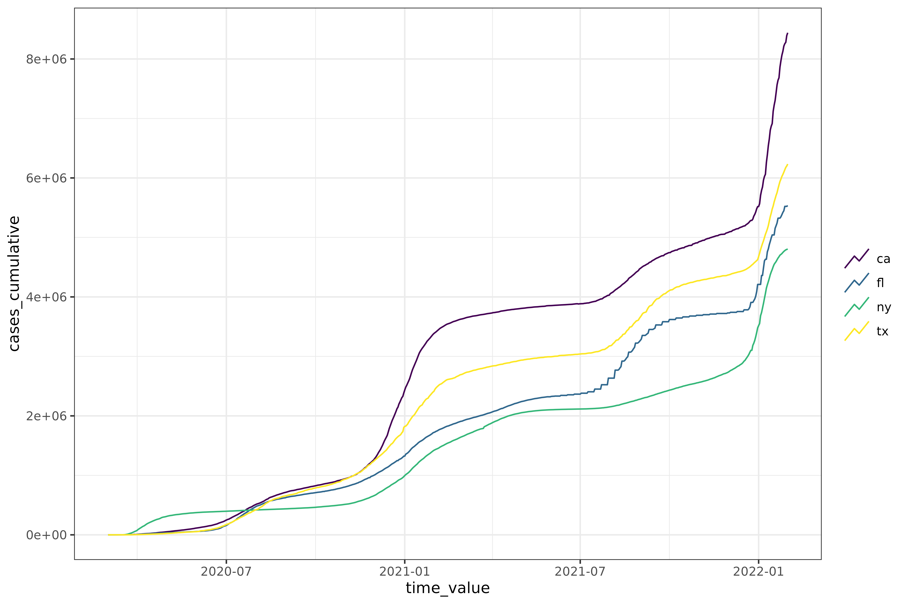

# Get started with epiprocess

## Overview

This vignette provides a brief introduction to the
[epiprocess](https://github.com/cmu-delphi/epiprocess) package. We will
do the following:

- Get data into
  [`epi_df()`](https://cmu-delphi.github.io/epiprocess/dev/reference/epi_df.md)
  format and plot the data
- Perform basic signal processing tasks (lagged differences, rolling
  average, cumulative sum, etc.)
- Detect outliers in the data and apply corrections
- Calculate the growth rate of the data
- Get data into
  [`epi_archive()`](https://cmu-delphi.github.io/epiprocess/dev/reference/epi_archive.md)
  format and perform similar signal processing tasks

## Getting data into `epi_df` format

We’ll start by getting data into
[`epi_df()`](https://cmu-delphi.github.io/epiprocess/dev/reference/epi_df.md)
format, which is just a tibble with a bit of special structure. As an
example, we will get COVID-19 confirmed cumulative case data from JHU
CSSE for California, Florida, New York, and Texas, from March 1, 2020 to
January 31, 2022. We have included this example data in the
[`epidatasets::covid_confirmed_cumulative_num`](https://cmu-delphi.github.io/epidatasets/reference/covid_confirmed_cumulative_num.html)
object, which we prepared by downloading the data using
[`epidatr::pub_covidcast()`](https://cmu-delphi.github.io/epidatr/reference/pub_covidcast.html).

``` r

library(epidatr)
library(epiprocess)
library(dplyr)
library(tidyr)
library(withr)

covid_confirmed_cumulative_num
class(covid_confirmed_cumulative_num)
colnames(covid_confirmed_cumulative_num)
```

The same data can be downloaded with
[epidatr](https://cmu-delphi.github.io/epidatr/) as follows:

``` r

covid_confirmed_cumulative_num <- pub_covidcast(
  source = "jhu-csse",
  signals = "confirmed_cumulative_num",
  geo_type = "state",
  time_type = "day",
  geo_values = "ca,fl,ny,tx",
  time_values = epirange(20200301, 20220131),
)
```

The tibble returned has the columns required for an `epi_df` object,
`geo_value` and `time_value`, so we can convert it directly to an
`epi_df` object using
[`as_epi_df()`](https://cmu-delphi.github.io/epiprocess/dev/reference/epi_df.md).

``` r

edf <- covid_confirmed_cumulative_num %>%
  select(geo_value, time_value, cases_cumulative = value) %>%
  as_epi_df() %>%
  group_by(geo_value) %>%
  mutate(cases_daily = cases_cumulative - lag(cases_cumulative, default = 0))
edf
#> An `epi_df` object, 2,808 x 4 with metadata:
#> * geo_type  = state
#> * time_type = day
#> * as_of     = 2026-07-20 16:45:36.140688
#> Latency (time between last available observation and epi_df's as_of, by time series):
#> * latency across all time series = 1631 days
#> 
#> # A tibble: 2,808 × 4
#> # Groups:   geo_value [4]
#>   geo_value time_value cases_cumulative cases_daily
#>   <chr>     <date>                <dbl>       <dbl>
#> 1 ca        2020-03-01               19          19
#> 2 fl        2020-03-01                0           0
#> 3 ny        2020-03-01                0           0
#> 4 tx        2020-03-01                0           0
#> 5 ca        2020-03-02               23           4
#> 6 fl        2020-03-02                1           1
#> # ℹ 2,802 more rows
```

In brief, we can think of an `epi_df` object as snapshot of an
epidemiological data set as it was at a particular point in time
(recorded in the `as_of` attribute). We can easily plot the data using
the
[`autoplot()`](https://ggplot2.tidyverse.org/reference/autoplot.html)
method (which is a convenience wrapper to `ggplot2`).

``` r

edf %>%
  autoplot(cases_cumulative)
```



We can compute the 7 day moving average of the confirmed daily cases for
each `geo_value` by using the
[`epi_slide_mean()`](https://cmu-delphi.github.io/epiprocess/dev/reference/epi_slide_opt.md)
function. For a more in-depth guide to sliding, see
[`vignette("epi_df")`](https://cmu-delphi.github.io/epiprocess/dev/articles/epi_df.md).

``` r

edf %>%
  group_by(geo_value) %>%
  epi_slide_mean(cases_daily, .window_size = 7, na.rm = TRUE)
#> An `epi_df` object, 2,808 x 5 with metadata:
#> * geo_type  = state
#> * time_type = day
#> * as_of     = 2026-07-20 16:45:36.140688
#> Latency (time between last available observation and epi_df's as_of, by time series):
#> * latency across all time series = 1631 days
#> 
#> # A tibble: 2,808 × 5
#> # Groups:   geo_value [4]
#>   geo_value time_value cases_cumulative cases_daily cases_daily_7dav
#>   <chr>     <date>                <dbl>       <dbl>            <dbl>
#> 1 ca        2020-03-01               19          19            19   
#> 2 ca        2020-03-02               23           4            11.5 
#> 3 ca        2020-03-03               29           6             9.67
#> 4 ca        2020-03-04               40          11            10   
#> 5 ca        2020-03-05               50          10            10   
#> 6 ca        2020-03-06               68          18            11.3 
#> # ℹ 2,802 more rows
```

We can compute the growth rate of the confirmed cumulative cases for
each `geo_value`. For a more in-depth guide to growth rates, see
[`vignette("growth_rate")`](https://cmu-delphi.github.io/epiprocess/dev/articles/growth_rate.md).

``` r

edf %>%
  group_by(geo_value) %>%
  mutate(cases_growth = growth_rate(x = time_value, y = cases_cumulative, method = "rel_change", h = 7))
#> An `epi_df` object, 2,808 x 5 with metadata:
#> * geo_type  = state
#> * time_type = day
#> * as_of     = 2026-07-20 16:45:36.140688
#> Latency (time between last available observation and epi_df's as_of, by time series):
#> * latency across all time series = 1631–1632 days
#> 
#> # A tibble: 2,808 × 5
#> # Groups:   geo_value [4]
#>   geo_value time_value cases_cumulative cases_daily cases_growth
#>   <chr>     <date>                <dbl>       <dbl>        <dbl>
#> 1 ca        2020-03-01               19          19        0.534
#> 2 fl        2020-03-01                0           0      Inf    
#> 3 ny        2020-03-01                0           0      Inf    
#> 4 tx        2020-03-01                0           0      Inf    
#> 5 ca        2020-03-02               23           4        0.579
#> 6 fl        2020-03-02                1           1        2.32 
#> # ℹ 2,802 more rows
```

Detect outliers in daily reported cases for each `geo_value`. For a more
in-depth guide to outlier detection, see
[`vignette("outliers")`](https://cmu-delphi.github.io/epiprocess/dev/articles/outliers.md).

``` r

edf %>%
  group_by(geo_value) %>%
  mutate(outlier_info = detect_outlr(x = time_value, y = cases_daily)) %>%
  ungroup()
#> An `epi_df` object, 2,808 x 5 with metadata:
#> * geo_type  = state
#> * time_type = day
#> * as_of     = 2026-07-20 16:45:36.140688
#> Latency (time between last available observation and epi_df's as_of, by time series):
#> * latency across all time series = 1631 days
#> 
#> # A tibble: 2,808 × 5
#>   geo_value time_value cases_cumulative cases_daily outlier_info$rm_lower
#>   <chr>     <date>                <dbl>       <dbl>                 <dbl>
#> 1 ca        2020-03-01               19          19                  0.5 
#> 2 fl        2020-03-01                0           0                 -2.5 
#> 3 ny        2020-03-01                0           0                 -2.5 
#> 4 tx        2020-03-01                0           0                 -2   
#> 5 ca        2020-03-02               23           4                  0.25
#> 6 fl        2020-03-02                1           1                 -1.75
#> # ℹ 2,802 more rows
#> # ℹ 5 more variables: outlier_info$rm_upper <dbl>, $rm_replacement <dbl>, …
```

Add a column to the epi_df object with the daily deaths for each
`geo_value` and compute the correlations between cases and deaths for
each `geo_value`. For a more in-depth guide to correlations, see
[`vignette("correlation")`](https://cmu-delphi.github.io/epiprocess/dev/articles/correlation.md).

``` r

df <- pub_covidcast(
  source = "jhu-csse",
  signals = "deaths_incidence_num",
  geo_type = "state",
  time_type = "day",
  geo_values = "ca,fl,ny,tx",
  time_values = epirange(20200301, 20220131),
) %>%
  select(geo_value, time_value, deaths_daily = value) %>%
  as_epi_df() %>%
  arrange_canonical()
edf <- inner_join(edf, df, by = c("geo_value", "time_value"))
edf %>%
  group_by(geo_value) %>%
  epi_slide_mean(deaths_daily, .window_size = 7, na.rm = TRUE) %>%
  epi_cor(cases_daily, deaths_daily)
#> # A tibble: 4 × 2
#>   geo_value   cor
#>   <chr>     <dbl>
#> 1 ca        0.202
#> 2 fl        0.245
#> 3 ny        0.183
#> 4 tx        0.359
```

Note that if an epi_df object loses its `geo_value` or `time_value`
columns, it will decay to a regular tibble.

``` r

edf %>% select(-time_value)
#> # A tibble: 2,808 × 4
#> # Groups:   geo_value [4]
#>   geo_value cases_cumulative cases_daily deaths_daily
#>   <chr>                <dbl>       <dbl>        <dbl>
#> 1 ca                      19          19            0
#> 2 fl                       0           0            0
#> 3 ny                       0           0            0
#> 4 tx                       0           0            0
#> 5 ca                      23           4            0
#> 6 fl                       1           1            0
#> # ℹ 2,802 more rows
```

## Getting data into `epi_archive` format

We can also get data into
[`epi_archive()`](https://cmu-delphi.github.io/epiprocess/dev/reference/epi_archive.md)
format, which can be thought of as an aggregation of many `epi_df`
snapshots. We can perform similar signal processing tasks on
`epi_archive` objects as we did on `epi_df` objects, though the
interface is a bit different.

``` r

library(epidatr)
library(epiprocess)
library(data.table)
library(dplyr)
library(purrr)
library(ggplot2)

dv <- pub_covidcast(
  source = "doctor-visits",
  signals = "smoothed_adj_cli",
  geo_type = "state",
  time_type = "day",
  geo_values = "ca,fl,ny,tx",
  time_values = epirange(20200601, 20211201),
  issues = epirange(20200601, 20211201)
) %>%
  select(geo_value, time_value, issue, percent_cli = value) %>%
  as_epi_archive()
dv
```

    #> An `epi_archive` object, with:
    #> ℹ Time range:    2020-06-01 -- 2021-11-26 (times are days)
    #> ℹ Version range: 2020-06-06 -- 2021-11-29
    #> ℹ A preview of the table (117124 rows x 4 columns):
    #> Key: <geo_value, time_value, version>
    #>         geo_value time_value    version percent_cli
    #>            <char>     <Date>     <Date>       <num>
    #>      1:        ca 2020-06-01 2020-06-06    2.140116
    #>      2:        ca 2020-06-01 2020-06-08    2.140379
    #>      3:        ca 2020-06-01 2020-06-09    2.114430
    #>      4:        ca 2020-06-01 2020-06-10    2.133677
    #>      5:        ca 2020-06-01 2020-06-11    2.197207
    #>     ---                                            
    #> 117120:        tx 2021-11-23 2021-11-29    2.159704
    #> 117121:        tx 2021-11-24 2021-11-27    2.024028
    #> 117122:        tx 2021-11-24 2021-11-29    1.937911
    #> 117123:        tx 2021-11-25 2021-11-29    1.866631
    #> 117124:        tx 2021-11-26 2021-11-29    1.858596

See
[`vignette("epi_archive")`](https://cmu-delphi.github.io/epiprocess/dev/articles/epi_archive.md)
for a more in-depth guide to `epi_archive` objects.

## Advanced Plotting

The [epiprocess](https://github.com/cmu-delphi/epiprocess) package
provides advanced visualization capabilities for both `epi_df` and
`epi_archive` objects, including interactive plotting and multi-variable
heatmaps. For a detailed overview and examples, see
[`vignette("advanced_plotting")`](https://cmu-delphi.github.io/epiprocess/dev/articles/advanced_plotting.md).

## Data attribution

This document contains a dataset that is a modified part of the
[COVID-19 Data Repository by the Center for Systems Science and
Engineering (CSSE) at Johns Hopkins
University](https://github.com/CSSEGISandData/COVID-19) as [republished
in the COVIDcast Epidata
API](https://cmu-delphi.github.io/delphi-epidata/api/covidcast-signals/jhu-csse.html).
This data set is licensed under the terms of the [Creative Commons
Attribution 4.0 International
license](https://creativecommons.org/licenses/by/4.0/) by the Johns
Hopkins University on behalf of its Center for Systems Science in
Engineering. Copyright Johns Hopkins University 2020.

[From the COVIDcast Epidata
API](https://cmu-delphi.github.io/delphi-epidata/api/covidcast-signals/jhu-csse.html):
These signals are taken directly from the JHU CSSE [COVID-19 GitHub
repository](https://github.com/CSSEGISandData/COVID-19) without changes.
